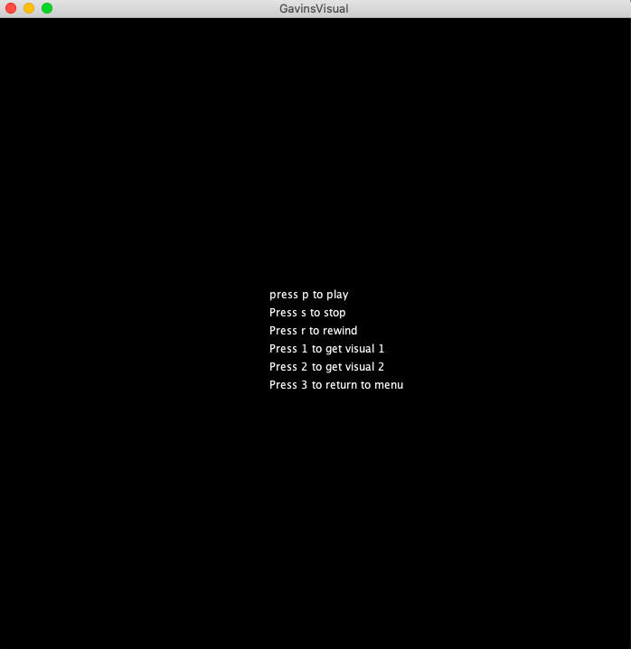
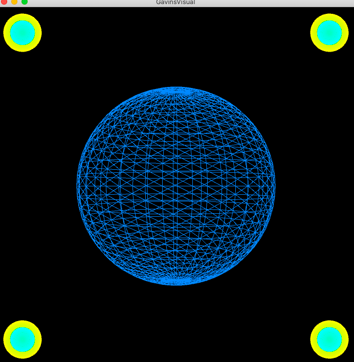
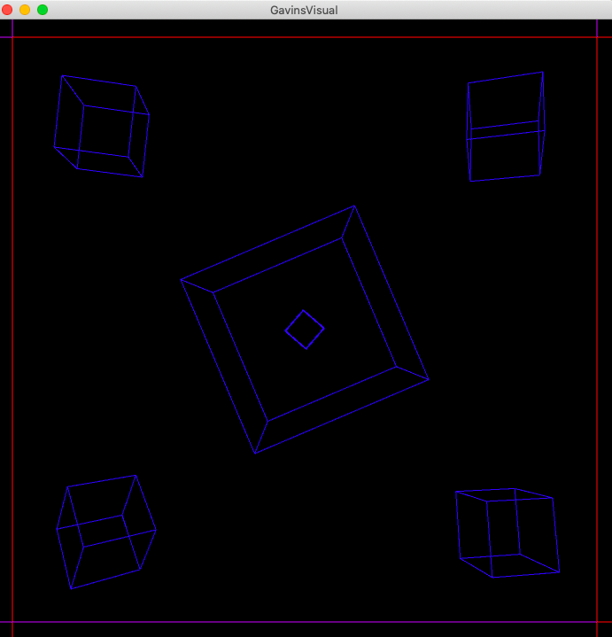

# Music Visualiser Project

Name: Gavin Fahy

Student Number: C19507466

## Instructions
- Fork this repository and use it a starter project for your assignment
- Create a new package named your student number and put all your code in this package.
- You should start by creating a subclass of ie.tudublin.Visual
- There is an example visualiser called MyVisual in the example package
- Check out the WaveForm and AudioBandsVisual for examples of how to call the Processing functions from other classes that are not subclasses of PApplet

# Description of the assignment
For my OOP assiggnment we were givven a brief that stated "Something beautiful to enjoy while listening to music". I wanted to create a visual experience that a user of my program could relax to while enjoying some of there favourit music. The song i chose to run in my program was Michael Calfan - Resurrection (Axwell's Recut Club Version). It is very simple to change the song that is playing in the ht assignment as you jsut need to download a song and cnage the name of the song in the GavinsVisuals class to play your new song. This song does not contain any lyrics. The reason I chose this song is due to the fact when i am training in the gym it it aids me in my workout and working out in the gym and exercising is a very important aspect of my life and I wanted to pay homage to a song that is very important to me. I sought out to make my visuals to be very simplistic but relaxing as this is how I find the song to be for me. The visuals I created react to the music by changing colour and increasing its amplitude from "getSmoothedAmplitude" in my code. 

# Instructions
To play music press p

To stop the music press s

To rewind the music to the beginning press r

To switch to the first visual press 1

To switch to the second visual press 2

To switch back to the main menu press 3

# How it works
In GavinsVisual there is a Papplet that contains the processors signals that connect each of my classes to the GavinVisual class

    public class GavinsVisual extends Visual {

    Sphere s;
    Circle c;
    Cube cube;
    Line l;
    Instructions i;
In every class i created there are constructrs at the begining that allos each class to be connected to GavinsVisual

    public Sphere(GavinsVisual gv)
      {
          this.gv = gv;
      }
      
In GavinsVisual there is a method that  sets the size of the screen for every visual to be the same and allows for 3D displays

    public void settings()
     {
         size(700, 700, P3D);
     }

Thanks to my setup method in GavinsVisual i have inisitalised each of my other classes and called the song I wish to play
    
    public void setup()
     {
         startMinim();
         surface.setResizable(true);

         loadAudio("Michael Calfan - Resurrection (Axwell's Recut Club Version).mp3");

         s = new Sphere(this);
         c = new Circle(this);
         cube = new Cube(this);
         l = new Line(this);
         i = new Instructions(this);
     }
     
In Gavins visual ther is a keypressed method that allows the user to play, stop and rewind the music
    
    public void keyPressed()
    {
        if (key == 'p')
        {
            getAudioPlayer().play();
        }
        if (key == 's')
        {
            getAudioPlayer().pause();
        }
        if (key == 'r')
        {
            getAudioPlayer().cue(0);
        }
    }
    

In GavinsVisual i created variables that were set to 0 and one that was set to 1

    int cubeOption = 0;
    int sphereOption = 0;
    int circleOption = 0;
    int lineOption = 0;
    int instructionsOption = 1;
Then  in the draw class i set it so if a specific key has been pressed it will allocate sertain variables the value 1 or value 0. When
this happes depending on what variables are allocated 1 or 0 will dictate what visual is rendered to the screen.

    if (key == '1')
    {
        sphereOption = 1;
        circleOption = 1;
        instructionsOption = 0;

        cubeOption = 0;
        lineOption = 0;
    }

    if (key == '2')
    {
       cubeOption = 1;
       lineOption = 1;
       instructionsOption = 0;

       sphereOption = 0;
       circleOption = 0;
    }

    if (key == '3')
    {
        instructionsOption = 1;
        
        sphereOption = 0;
        circleOption = 0;
        lineOption = 0;
        cubeOption = 0;
    }

    if(instructionsOption == 1)
    {
        i.render();
    }

    if(sphereOption == 1 && circleOption == 1)
    {
        s.render();
        c.render();
    }

    if(cubeOption == 1 && lineOption == 1)
    {
        cube.render();
        l.render();
    }
    
# What I am most proud of in the assignment
What I am most proud of in this assignment is the entirity of the fist visual. After attending every lecture during this semester I was still finding Java very difficult to learn and i was struggling with alot the basics in the course. One such thing I was struggling with was mapping and dealing with cordinates. I had many ideas how i wanted the fist visual to be played and many of the ideas ended up falling apart as i was struggling with the mapping of the cordinates. After reviewing lectures that covered mapping and watching many youtube tutorials i was finnaly able to get the hang of mapping and was able to map each pulsating circle into the four corners of the screen. This may not seem like a very difficult task to do but due to how I was struggling I in the course i was very proud of myself after creating the circles and being able to map them. THen after this i watched youtube turorials on how to create a sphere and using the lecture where we creaed the 3D box i was able to create the sphere and have it react to the music. This is why the first visual is what I am the most proud of as I really stuck it out and did alot of research to get it completed. Even tho it might seem very simple to people I was very happy with the outcome of it.
This code is the code for the sphere and is what I am proud of. 

    gv.colorMode(PApplet.HSB);
    gv.pushMatrix();
    gv.translate(350, 350, -200);
    gv.rotateY(angle);
    gv.noFill();
    gv.stroke(PApplet.map(gv.getSmoothedAmplitude()*5,0,1,0,255),255,255);
    gv.sphere(200+gv.getSmoothedAmplitude()*400);
    gv.popMatrix();
    angle += gv.getSmoothedAmplitude()*20;
One new thing I learnt that stuck out to me in the process of creating the sphere method was the push and pop matirix parts of the code. As without it my entire visual would fall apart and it was enjoyable learning and seeing what would happen without those two lines of code.

Main menu 
This visual calles the Instructions.java class that contains all the text that is printed to the screen to display the menu I created.

First Visual
This visual is called from the Sphere.java class to display the sphere 
The Circle.java class is also called to display the circles

Second Visual
This visual is called from the Cube.java class for the cubes to be displayed
The Line.java class is also called to display the lines in the visual

# Markdown Tutorial
This is a youtube video:

This is a table:

| Heading 1 | Heading 2 |
|-----------|-----------|
|Some stuff | Some more stuff in this column |
|Some stuff | Some more stuff in this column |
|Some stuff | Some more stuff in this column |
|Some stuff | Some more stuff in this column |

